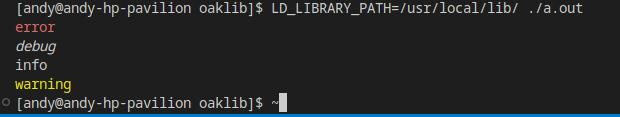

# OakLib
### A simple C library for simple stuff

# Usage
This is currently a logging library that can be either statically or dynamically linked!

# Building
Its as simple as `make` (builds both a dynamic library and a static library)

# Installing
Run `PREFIX=/usr make install` (or set `PREFIX` to `/usr/local` if you have your environment set up correctly) as `root` (Superuser)

# Uninstalling
Run `PREFIX=/usr make uninstall` as `root` (Superuser)

# Testing
`gcc test.c -loaklib` (if using a shared library) (Replace GCC with your preferred C compiler)
`./a.out` (Set `LD_LIBRARY_PATH` if you installed with a prefix that wasn't /usr)

If you followed these vauge steps correctly (works on my machine!) it should look like the below image:
